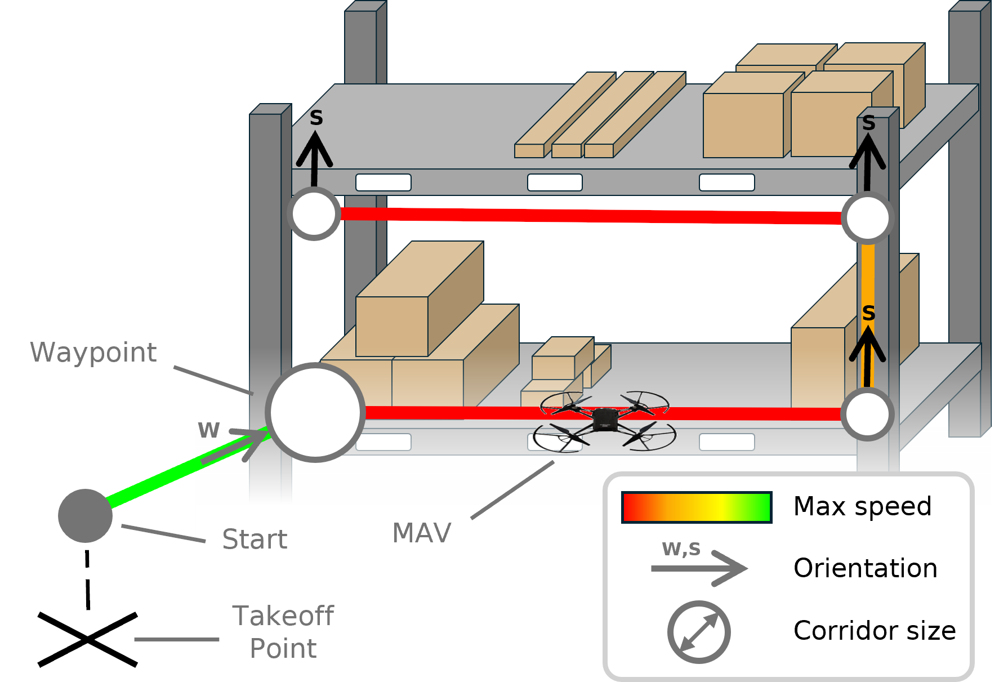

# Constrained MAV Navigation

<p align="center">
	
</p>

This repository contains the source code of the paper [Reinforcement Learning-based MAV Navigation With Parameterized Waypoints: Incorporating Orientation, Speed Limits, and Corridor Constraints](https://doi.org/TODO). It includes simulated drone dynamics, waypoint-based tasks, classical and reinforcement learning controllers, and control barrier functions.

## Project structure

- `Unity/` contains the Unity project.
- `Python/` contains the trajectory server and an ML-Agents training configuration.

## Getting started

1. Open `Unity/` as a project in Unity 6000.0.34f1.
2. Open `Assets/Scenes/Evaluation.unity` in Unity. The scene is configured with the `AgentRobotConf` agent, its trained model, and the Wall Inspection parcours. To test a different agent or parcours, select `EvaluationEnvironment` in the Hierarchy and change `Agent Prefab` or `Current Parcours` in the Inspector. Agent prefabs are in `Assets/Prefabs/Agents/`; parcours indices are 0 (Eight), 1 (Fly Around), and 2 (Wall Inspection).
3. If you selected the PD or MPC agent, install the Python requirements and start the trajectory server as described in the [Python guide](Python/README.md).
4. Press **Play** in Unity. Select `EvaluationEnvironment` in the Hierarchy and click **Start Evaluation** in the Inspector to run the selected agent.

## Citation

Please cite the following paper in your publications if you use this project in your research:

```bibtex
@inproceedings{Constrained_MAV_Nav2026,
    author    = "Kirsch, André and Rexilius, Jan",
    title     = "Reinforcement Learning-based MAV Navigation With Parameterized Waypoints: Incorporating Orientation, Speed Limits, and Corridor Constraints",
    year      = 2026,
    booktitle = "9th Iberian Robotics Conference (ROBOT2026)",
    doi       = "TODO"
}
```

---

## License

This [work](https://github.com/IoT-Lab-Minden/Constrained_MAV_Navigation) by [André Kirsch](https://github.com/AKirsch1) and [Jan Rexilius](https://github.com/jrx-hsbi) is licensed under [MIT](LICENSE).
